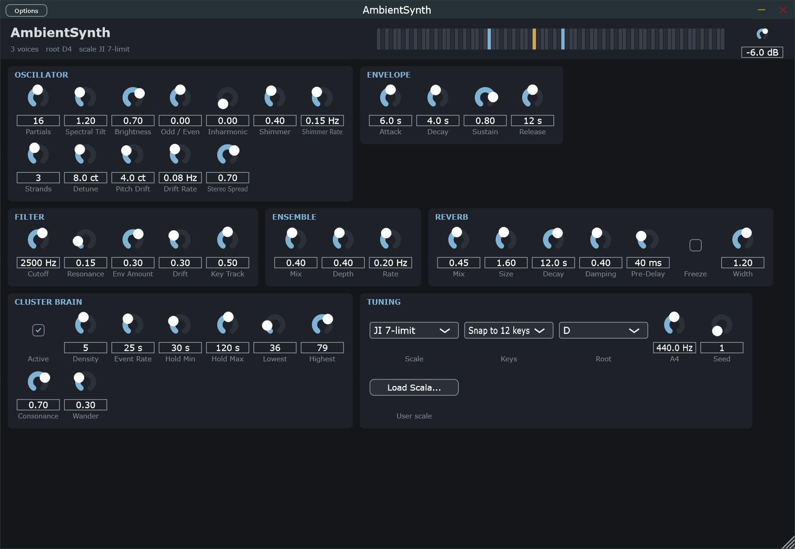
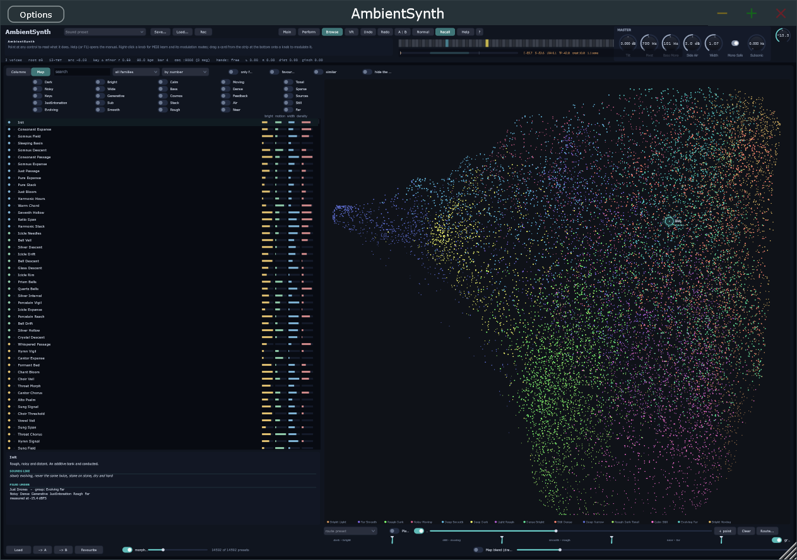

# AmbientSynth

A drone-ambient synthesizer for slowly evolving polyphonic clusters, in the spirit of Robert
Rich's sleep concerts: just-intonation tunings, additive partial banks that breathe, envelopes
measured in minutes, a conductor that plays the piece on its own, and a spatial model that treats
depth as a landscape — dry, bright voices in the foreground against a dark, wide, infinite
background.

**VST3 plugin and standalone application** for Windows (x64). Licence: AGPL-3.0.

<br clear="left" />



## Download

**[AmbientSynth-1.12.0-Setup.exe](https://github.com/reneweller-coding/AmbientSynth/releases/download/v1.12.0/AmbientSynth-1.12.0-Setup.exe)**
installs the standalone, the VST3 and the preset library, and offers to download the 10 GB sample
library. Nothing else has to be installed: the runtime is linked in.
**[Portable zip](https://github.com/reneweller-coding/AmbientSynth/releases/download/v1.12.0/AmbientSynth-1.12.0-portable.zip)**
for anyone who would rather not run an installer, and the
**[manual](https://github.com/reneweller-coding/AmbientSynth/releases/download/v1.12.0/AmbientSynth-Manual.pdf)**
— every tab of the panel as a picture, what its knobs mean, and seven chapters on why the
instrument is built the way it is, with the mathematics and the references.

Requirements: Windows 10 or 11, a 64-bit processor with AVX2 (every x86-64 since 2013), and a VST3
host if you want the plugin.

## What is in it

* **Four source slots per voice** — additive bank, wavetable, two-operator FM, granular texture, a
  spectral stretch that turns a field recording into weather, ten noise colours — and a vector
  that reads four of them as the corners of one square. Each slot enters on its own clock: up to
  half a minute of delay after the note, then a fade or one of the preset's sixteen-breakpoint
  envelope shapes, so a texture can arrive under a wavetable that is already sounding.
* **Two filters**: ten models with a wavefolder, and a Z-plane morphing filter after the E-mu
  Morpheus with 155 shapes, a cube rather than a square, and a modal mode that turns it into a
  struck body.
* **A spatial model** in which every note has a distance. Brightness, level, dryness and presence
  follow from that one number, with a true interaural time difference, Doppler, headphone
  externalisation and a vertical axis heard through the pinna's elevation notch. Three reverb
  tiers: near room, far reverb, convolution room.
* **The Cosmos**: a parallel path of frequency shifter, tuned resonators, a vowel filter, a
  spectral nebula and a self-regulating shimmer loop.
* **A conductor that plays all night.** The Cluster Brain chooses notes from the scale, places them
  on the planes and holds them for minutes. It judges a chord four ways, finds the key it has
  drifted into, makes its clock a Hawkes process — events that cause events — and tunes each
  arriving note pure against what is already sounding.
* **Thirteen tunings**: twelve just and historical tables, Scala files, and one that sweeps the
  instrument's own roughness curve and puts a degree wherever it dips, so the tuning follows the
  sound.
* **Modulation everywhere**: eight LFOs, six hand-drawn envelopes, eight macros, four coupled
  Kuramoto oscillators, a Lenia field, the Lorenz and Rössler attractors on a scale of minutes,
  aftertouch, wheel and slide — all through one matrix onto any knob, including the modulators'
  own.
* **8400 presets in 42 packs**, each written in the spirit of an artist of the genre, every one
  rendered, measured and gain-matched; 6354 samples, 2096 wavetables and 546 impulse responses,
  two thirds of the wavetables and half the impulses cut from the recordings rather than designed.



The map is a free cloud of all 8400 presets, dense where the library repeats itself and empty
where it is thin, laid out from nine measured descriptors: dark is left, evolving is up, and the
colours are groups named after what makes each one itself. Put the cursor between points and the
instrument plays a blend of the presets around it, a sound nobody saved. Changing presets is a
crossfade between two engines, so anything can meet anything in the air.

Every voice, every plane, every effect answers to MIDI, MPE, OSC or hand tracking through the
same parameters, and everything measured about a preset — how bright, how far, how much it moves
over a minute — is measured from a render of it, not read off a knob.

## Layout

| Directory | What | Depends on |
|---|---|---|
| `Core/` | The whole synthesizer: parameters, tuning, voices, spatial routing, effects, conductor, presets, engine. Pure C++20, no allocations while rendering. | nothing |
| `Plugin/` | JUCE wrapper: VST3 + standalone, the panel, preset browser and map, state. | JUCE 9 (fetched by CMake) |
| `Tools/render/` | `ambient_render`: offline renderer to WAV with per-second measurements. | Core |
| `Tools/library/` | The library pipeline: generates, renders, measures and lays out the presets. | Python, numpy |
| `Tests/` | The self test, the host test and the race test (below). | Core, JUCE for the host test |
| `Deploy/` | `build_release.ps1` builds, checks and packages; `AmbientSynth.iss` is the installer. | Inno Setup 6+ |
| `Quest/` | A native Meta Quest app against the same core: OpenXR, hand tracking, Oboe. Builds; not yet run on a headset. | NDK, OpenXR, Oboe |
| `docs/concept.md` | Sound-design and architecture notes. | |

## Build

```bash
cmake -S . -B build -G "Visual Studio 18 2026" -A x64
cmake --build build --config Release
```

Outputs: the VST3 under `build/Plugin/AmbientSynth_artefacts/Release/VST3/` (copy the folder to
`C:\Program Files\Common Files\VST3`), the standalone beside it, `ambient_render` under
`build/Tools/render/Release/`, and the tests under `build/Tests/Release/`. The first configure
downloads JUCE. `-DAMBIENT_BUILD_PLUGIN=OFF` builds only the core and the tools, which needs no
JUCE and also builds on Linux.

## Checking it

Three binaries. `ambient_selftest` measures the instrument: tuning, envelopes, the conductor,
determinism. `ambient_hosttest` measures the plugin around it — rates from 44.1 to 96 kHz and
blocks from 16 to 2048, a state that comes back exactly as it went out, programs changed while
audio runs, and four seconds of two threads writing every parameter while it plays. Run it
**without** `AMBIENT_MUTE`: it measures levels. `ambient_racetest` renders on one thread while
another changes everything a window can change, as fast as it can; it exists because nearly every
serious fault this instrument has had was a handover between those two threads.

```bash
build/Tests/Release/ambient_selftest.exe
build/Tests/Release/ambient_hosttest.exe
build/Tests/Release/ambient_racetest.exe 4
```

`AMBIENT_FUZZ=1` turns the host test into a tool: it sets every parameter at random, then moves one
section at a time while a chord plays, and names any section whose sound stops being a number.

Before a release, two more that do not live here. [pluginval](https://github.com/Tracktion/pluginval)
at strictness 10 exercises the VST3 through the format itself. The thread sanitizer exists only on
Linux, which is where the framework-free core comes in:

```bash
cmake -S . -B build-tsan -DAMBIENT_BUILD_PLUGIN=OFF -DCMAKE_BUILD_TYPE=RelWithDebInfo \
      -DCMAKE_CXX_FLAGS="-fsanitize=thread -g -O1" -DCMAKE_EXE_LINKER_FLAGS="-fsanitize=thread"
cmake --build build-tsan -j && setarch $(uname -m) -R ./build-tsan/Tests/ambient_racetest 60
```

## Releasing

```powershell
powershell -File Deploy\build_release.ps1
```

Builds in its own tree with the runtime linked in and AVX2 on, runs the three tests in that exact
configuration, refuses to package a binary that still asks for any redistributable — Microsoft's or
Intel's — and leaves a setup and a portable zip in `Deploy\out` with their SHA-256 sums.

Releases are built with Intel's oneAPI compiler, which is about a fifth faster through the plugin
under load than MSVC. It puts a generative instrument on a different floating-point trajectory, so
it plays a different take of the same patch; over sixty presets the descriptors the map is laid out
from move by 5 % of a typical distance between two presets and the loudness by a hundredth of a
decibel, so the map and the loudness matching hold. `-Toolchain msvc` builds the same source with
Microsoft's compiler, for comparing the two rather than for packaging.

The sample library is 10 GB of FLAC in seven archives on the release page; the installer downloads
them with your consent, and the portable zip points to them in its README.
